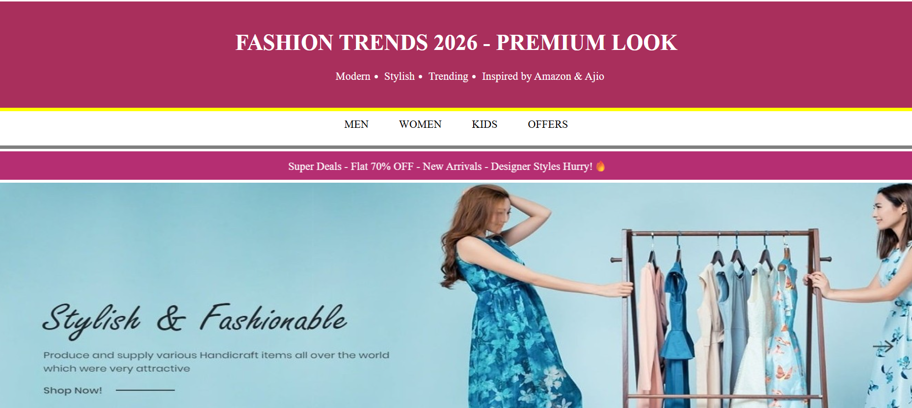

# 👗 Fashion Trends 2026 - Premium UI Website

🚀 A modern fashion landing page built using HTML5 and CSS3  
Inspired by Amazon & Ajio style UI design

---

## 🌐 Live Demo

👉 Click here to view project:  
https://somasindhuja.github.io/fashion-trends/

---

## 📸 Screenshot Preview

---

## ✨ Features

- 👕 Men / Women / Kids fashion collections  
- 💸 Offers & discount section  
- 🧭 Sticky navigation bar  
- 🎥 Embedded YouTube fashion video  
- 📢 Scrolling marquee banner  
- 🎨 Clean and modern UI design  

---

## 🛠️ Tech Stack

- HTML5  
- CSS3  

---

## 📁 Project Structure

fashiontrends/

│── index.html

│── fashiontrends.css

│── README.md

│
└── assets/

    └── images/
    
        ├── Fashion.jpg
        ├── Men1.jpeg
        ├── Men2.jpeg
        ├── Men3.jpeg
        ├── Men4.jpeg
        ├── Men5.jpeg
        ├── Women1.jpg
        ├── Women2.jpeg
        ├── Women3.jpeg
        ├── Women4.jpeg
        ├── Women5.jpeg
        ├── Kids1.jpeg
        ├── Kids2.jpeg
        ├── Kids3.jpeg
        ├── Kids4.jpeg
        ├── Kids5.jpeg
        └── preview.png

---

## 🚀 How to Run

1. Download or clone the repository  
2. Open folder in VS Code  
3. Open `fashiontrends.html` in browser  
   OR use **Live Server extension**

---

## 👨‍💻 Developer

Your Name  
📧 somasindhuja2002@gmail.com  
🔗 https://github.com/somasindhuja  

---

## ⭐ Support

If you like this project:

⭐ Star this repo  
🍴 Fork it  
📢 Share it  

---
